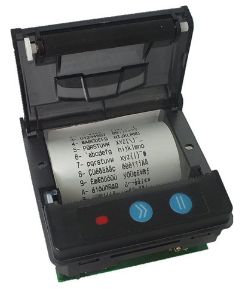
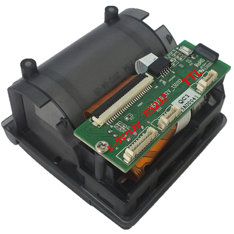

Android Thermal Printer driver for Android Things
=================================================

This driver provides easy access to cheap chinese thermal printers compatible with EML-205 / using
ESC/POS command set.

## Images





## Usage example
```java
    private void initPrinter(@NonNull final UartDevice uart) {
        Log.i(TAG, "Registering Thermal Printer");
        mPrinter = new ThermalPrinter(uart);
    }

    private void printTable() {
        mPrinter.print("Normal - NORMAL\n");
        mPrinter.setInverse(true);
        mPrinter.print("+ inversed INVERSED\n");
        mPrinter.setUpsideDown(true);
        mPrinter.print("+ upside DOWN\n");
        mPrinter.setBold(true);
        mPrinter.print("+ bold BOLD\n");
        mPrinter.setDoubleHeight(true);
        mPrinter.print("+ double Height\n");
        mPrinter.setDoubleWidth(true);
        mPrinter.print("+ double Width\n");
        mPrinter.sendRaw(Command.setUnderline(1));
        mPrinter.print("* Underlined ONE\n");
        mPrinter.sendRaw(Command.setUnderline(2));
        mPrinter.print("* Underlined TWO\n");
        mPrinter.sendRaw(Command.setUnderline(0));
        mPrinter.print("* Underlined ZERO\n");
        mPrinter.setAlternativeFont(true);
        mPrinter.print("+ alternative FONT\n");
        mPrinter.print("Normal - NORMAL\n");
        mPrinter.setInverse(false);
        mPrinter.print("- inversed INVERSED\n");
        mPrinter.setUpsideDown(false);
        mPrinter.print("- upside DOWN\n");
        mPrinter.setBold(false);
        mPrinter.print("- bold BOLD\n");
        mPrinter.setDoubleHeight(false);
        mPrinter.print("- double Height\n");
        mPrinter.setDoubleWidth(false);
        mPrinter.print("- double Width\n");
        mPrinter.sendRaw(Command.setUnderline(1));
        mPrinter.print("* Underlined ONE\n");
        mPrinter.sendRaw(Command.setUnderline(2));
        mPrinter.print("* Underlined TWO\n");
        mPrinter.setAlternativeFont(false);
        mPrinter.print("- alternative FONT\n");
    }

```

## Links
https://mike42.me/blog/what-is-escpos-and-how-do-i-use-it
https://www.aliexpress.com/item/Free-shipping-58mm-receipt-thermal-printer-Compatible-with-EML203/32336862542.html

